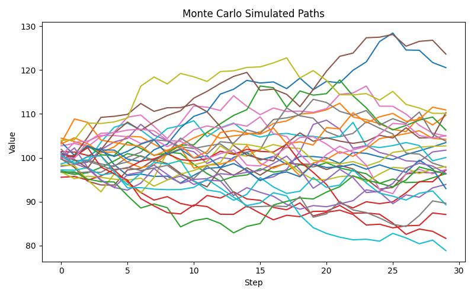
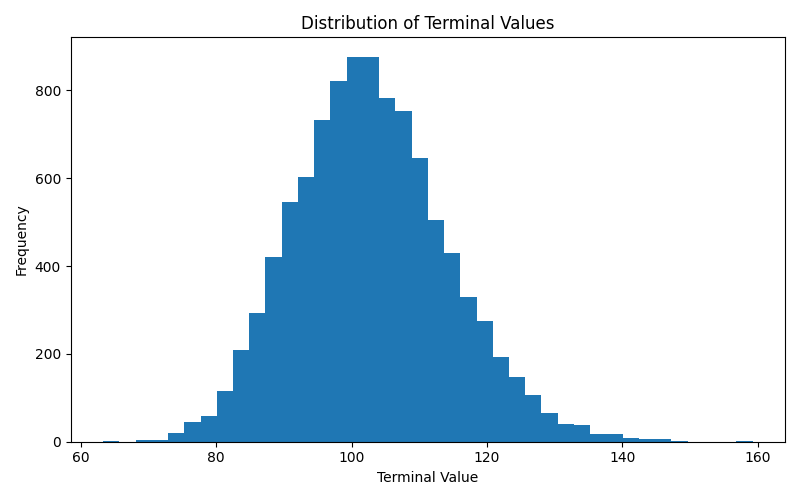

# Decision Engine Under Uncertainty

A modular Python framework that turns uncertain future outcomes into action recommendations using Monte Carlo simulation, expected value, and risk-adjusted scoring.

## Overview

This project models a common real-world problem: how to choose an action when the future is uncertain and the downside matters.

It is designed to demonstrate:
- stochastic simulation
- probabilistic reasoning
- risk-aware decision logic
- clean software structure

## Why this matters

Most high-value decisions happen under uncertainty:
- trading and portfolio decisions
- energy and infrastructure investment
- resource allocation
- strategic planning under downside risk

This framework separates those concerns into reusable layers.

## System Design

The code is split into three layers:

- **Simulation layer**: generates uncertain future outcomes
- **Decision layer**: evaluates whether action is justified
- **Risk layer**: quantifies downside and tail exposure

This makes the system easier to test, explain, and extend.

## Repository Structure

```text
decision-engine/
├── engine/
│   ├── __init__.py
│   ├── simulator.py
│   ├── decision.py
│   └── risk.py
├── examples/
│   ├── stock_case.py
│   └── energy_case.py
├── tests/
│   ├── test_simulator.py
│   └── test_decision.py
├── assets/
│   ├── monte_carlo_paths.png
│   └── terminal_histogram.png
├── README.md
├── requirements.txt
└── pyproject.toml
```

## Features

- vectorized Monte Carlo simulation with NumPy
- memory-efficient terminal-value simulation
- optional full-path simulation for analysis
- configurable shock distributions:
  - normal
  - Student-t
- reusable decision engine
- reusable risk metrics
- example scripts for finance and energy

## Example Visualization

Simulated Monte Carlo paths:



Distribution of terminal values:



## Installation

```bash
pip install -r requirements.txt
```

## Run the examples

```bash
python examples/stock_case.py
python examples/energy_case.py
```

## Run tests

```bash
pytest
```

## Future Improvements

- add Bayesian updating for dynamic belief revision
- support custom utility functions
- add portfolio-level analysis
- add additional shock models beyond normal and Student-t
- build a lightweight dashboard for scenario analysis

## Positioning

This project is relevant to:
- quantitative research
- simulation engineering
- technical strategy
- risk-aware planning
